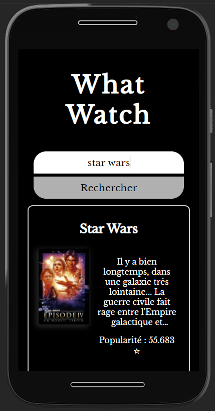

# Introduction

Ce projet est le résultat de la vidéo : [[PWA - Progressive Web App] Créer une application mobile avec HTML, CSS & Javascript](https://www.youtube.com/watch?v=pbSdAp8EmwI)

# Intérêts du projet

L'intéret premier de ce projet était de mettre en pratique une PWA autour d'une mini-application faisant appel à une API externe.

# Problèmes rencontrés

Aucun problème rencontré lors du projet. Tout s'est correctement déroulé !

# Améliorations apportées au projet

Ce projet étant très simple, et n'ayant rencontré aucun problème, je n'y ai donc apporté aucune modification.

# Ce que m'a apporté ce projet

J'ai pu réutilisé le serviceWorker que j'avais découvert lors de précédentes vidéos.

J'ai aussi pu voir ce qui était réellement utile pour mettre en place une PWA, ainsi que comment la tester à l'aide d'un émulateur Android d'Android Studio.

# Screenshots du résultat

